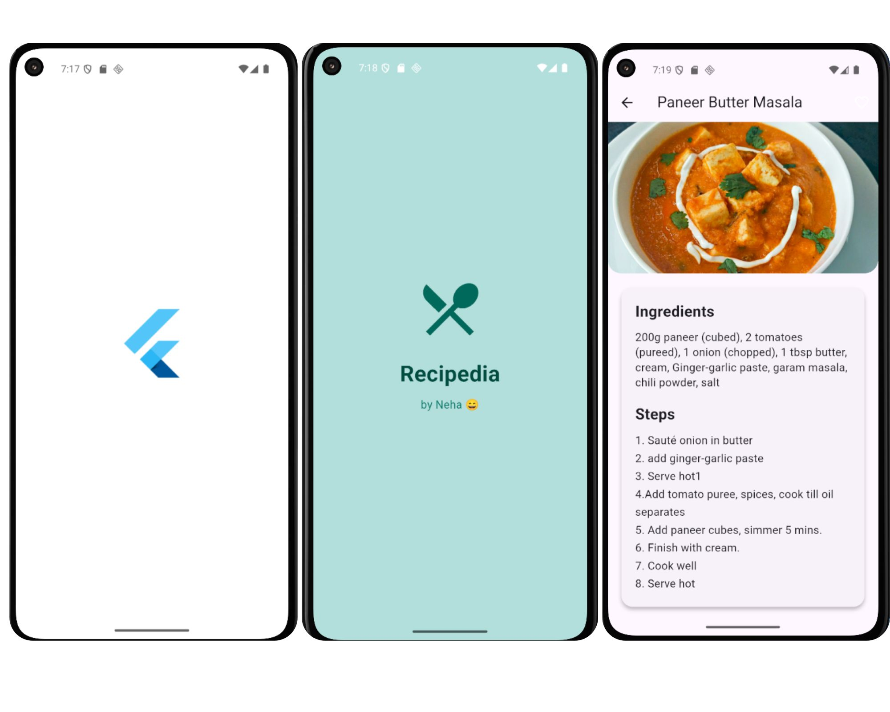
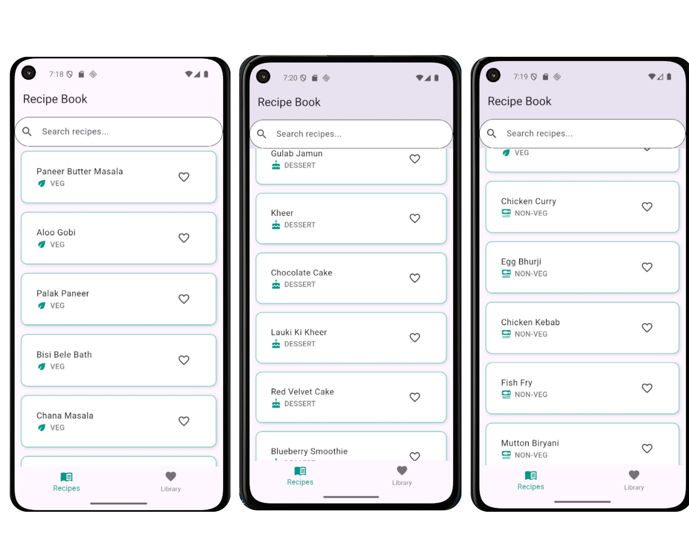
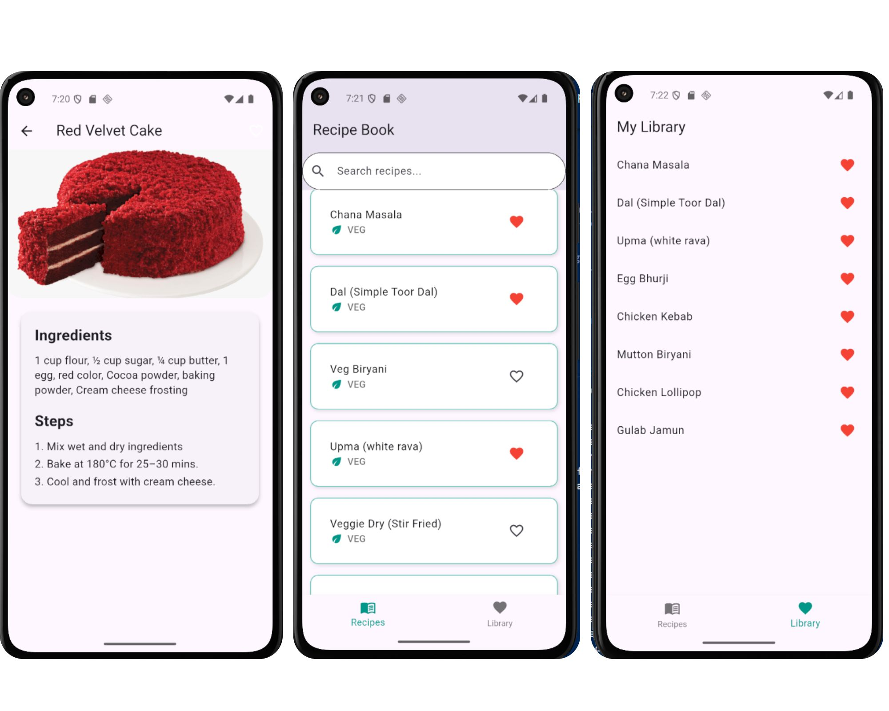

# Recipedia 

🍲 Recipedia – Your Personal Recipe Book App
Recipedia is a beautifully designed mobile application built using Flutter, crafted to make cooking easier and more enjoyable for everyone — from kitchen newbies to seasoned chefs.
This app lets users explore, organize, and personalize their favorite recipes in one convenient place.

With categorized sections for Veg, Non-Veg, and Desserts, and a clean, intuitive interface, Recipedia helps you discover delicious dishes quickly. Whether you’re craving a cozy dal, crispy chicken lollipop, or a sweet strawberry ice cream — it’s all here.

## Features ✨
1) 🔍 Search Recipes
Quickly find your favorite dish with the integrated search bar.

2) 🥗 Category-wise Organization
Recipes are grouped into three easy-to-navigate sections:

> Veg 🌿
> Non-Veg 🍗
> Desserts 🍰

3) 📖 Recipe Details
View short and clear steps along with ingredients for each recipe.

4) ❤️ Favorites Library
Save recipes you love for quick access anytime.

5) ➕ Add & Edit Recipes (Coming Soon)
Personalize your collection by adding or editing recipes.

6) 🤌 User-Friendly Interface
Minimal, foodie-themed design with gesture-based navigation.

## Outputs ✨

## Getting Started

This project is a starting point for a Flutter application.

A few resources to get you started if this is your first Flutter project:

- [Lab: Write your first Flutter app](https://docs.flutter.dev/get-started/codelab)
- [Cookbook: Useful Flutter samples](https://docs.flutter.dev/cookbook)

For help getting started with Flutter development, view the
[online documentation](https://docs.flutter.dev/), which offers tutorials,
samples, guidance on mobile development, and a full API reference.
